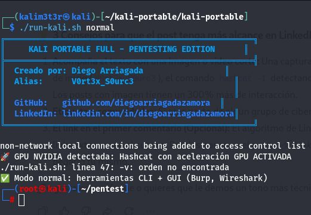
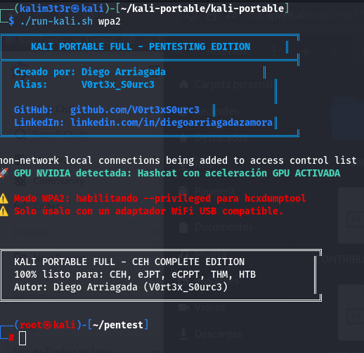
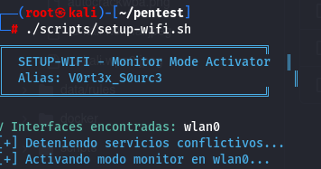

⁸# 🔐 Kali Portable Full - Red Team Edition

**Estación de pentesting completa en Docker con aceleración GPU**

[](https://opensource.org/licenses/MIT)
[](https://www.docker.com/)
[](https://developer.nvidia.com/cuda-zone)

---


🚀 Instalación en 3 Comandos


 1. Clonar el repositorio
git clone https://github.com/V0rt3xS0urc3/RedTeam-Portfolio.git
cd RedTeam-Portfolio/kali-portable

 2. Ejecutar el instalador automático

chmod +x scripts/install-on-new-pc.sh
./scripts/install-on-new-pc.sh

  El instalador automáticamente:

    ✅ Instala Docker (si no está)
    ✅ Configura GPU NVIDIA (si está disponible)
    ✅ Construye la imagen Docker con 100+ herramientas
    ✅ Descarga rockyou.txt (~133 MB)
    ✅ Descarga reglas de Hashcat
    ✅ Descarga wordlists para gobuster
    ✅ Configura permisos
    ✅ Hace pruebas finales

 El usuario no tiene que hacer NADA manualmente. Todo es automático.

 📚 Diccionarios Incluidos

El instalador descarga automáticamente:

- **rockyou.txt** (~133 MB) - El diccionario más famoso de filtraciones
- **Reglas de Hashcat** - best64.rule, d3ad0ne.rule, T0XlC.rule, leetspeak.rule
- **Wordlists para gobuster** - common.txt

Todos se descargan durante la instalación desde fuentes oficiales (Kali Linux, GitHub).

---

 3. ¡Listo! Iniciar el entorno

./run-kali.sh normal





 Tiempo de instalación: ~30-45 minutos (depende de tu conexión a internet)

## 🔄 Actualización de la Imagen

Para mantener Kali Portable actualizado con las últimas herramientas y paquetes:

```bash
cd kali-portable/docker
docker build --pull --no-cache -t kali-pentest-full .
```

**Frecuencia recomendada:** Cada 3-6 meses, o cuando se publiquen actualizaciones importantes de Kali Linux.

 📦 ¿Qué incluye?
 🛠️ Arsenal Completo de Red Team
 🔍 Escaneo y Reconocimiento

    Nmap, Masscan, RustScan - Escáneres de red
    Nikto, WhatWeb, WPScan - Escáneres web
    Gobuster, Dirb, FFUF - Fuzzing de directorios
    SQLMap, Nuclei - Vulnerabilidades web

 💥 Explotación

    Metasploit Framework - Plataforma de explotación
    Impacket, NetExec, CrackMapExec - Active Directory
    BloodHound - Análisis de relaciones AD
    
 🌐 Auditoría Web

    Burp Suite Community - Proxy interceptor
    SQLMap - SQL Injection automático
    Gobuster, FFUF, Wfuzz - Fuzzing avanzado
    Burp Suite, SQLMap, tplmap - Explotación web y SSTI
    jwt_tool - Análisis y ataques a JWT
    Gobuster, FFUF, Wfuzz, Nikto - Fuzzing y reconocimiento
    Weevely - Webshells y post-explotación web
    wrk - Benchmarking y pruebas de estrés HTTP

 📡 Auditoría WiFi y Cracking

    Hashcat - Con aceleración GPU NVIDIA CUDA
    Aircrack-ng Suite - Modo monitor y análisis
    Hydra, John the Ripper - Fuerza bruta

 🛡️ Evasión de Antivirus

    Veil Framework - Generación de payloads evasivos
    Shellter - Inyección de payloads
    TheFatRat - Generación de backdoors
    
 🔬 Análisis Forense

    Volatility 3 - Análisis de memoria
    Binwalk - Análisis de firmware
    Sleuth Kit - Análisis forense de discos

 📱 Mobile Hacking

    APKTool, Dex2Jar - Ingeniería inversa Android
    JADX - Descompilador Java
    MobSF - Mobile Security Framework

 🌐 IoT y SCADA

    RouterSploit - Framework para routers
    Binwalk - Análisis de firmware

 🔐 OSINT e Ingeniería Social

    Maltego - Análisis visual de relaciones
    theHarvester, Shodan CLI - Recolección de información
    Social Engineer Toolkit (SET) - Ingeniería social

 🏢 Active Directory

    Impacket Suite - Protocolos Windows
    BloodHound - Análisis de rutas de ataque
    NetExec, CrackMapExec - Movimiento lateral
    Certipy, Kerbrute - Ataques AD especializados

 🌐 Redes y Tunneling

    Wireshark, TCPDump - Análisis de tráfico
    Chisel, Ligolo-ng, SSHuttle - Túneles y pivoting
    OpenVPN - Conexión a THM/HTB
    
 ⚙️ Post-Explotación

    LinPEAS, WinPEAS - Enumeración automática
    Linux Exploit Suggester - Sugerencias de privesc
    Pwncat - Shell mejorada
    
 🎮 Plataformas de Práctica
   
    ✅ HackLabs - VMs locales
    ✅ TryHackMe - Con OpenVPN configurado
    ✅ HackTheBox - Con OpenVPN configurado
    ✅ VulnHub - VMs locales
    
 **📖 Uso**
 
 Modo Normal (Pentesting General + GPU)


./run-kali.sh normal


Este proyecto trabaja perfectamente con HackLabs
https://github.com/afsh4ck/HackLabs
Un proyecto creado por Alex Fernández Santos
https://www.linkedin.com/in/afsh4ck

📡 Guía Completa: Crackeo WPA2 con Kali Portable Full
⚠️ AVISO LEGAL
    Este tutorial es SOLO para fines educativos y auditorías autorizadas. Crackear redes WiFi sin permiso del propietario es ILEGAL en Chile (Ley 19.223) y en la mayoría de países. Usa esta guía únicamente en:

        Tu propia red
        Redes con autorización escrita del propietario
        Plataformas de práctica (TryHackMe, HackTheBox)

🎯 FASE 0: Preparación del Hardware
Requisitos:

    ✅ Adaptador WiFi USB compatible con modo monitor y inyección de paquetes
    ✅ Tarjetas recomendadas: Alfa AWUS036NHA, TP-Link TL-WN722N v1, Panda PAU09
    ❌ NO funcionan: La mayoría de tarjetas internas de laptops

Verificar que tu adaptador es compatible:
 Dentro del contenedor
lsusb
 Busca tu adaptador en la lista

 Verificar drivers
iw list | grep -A 10 "Supported interface modes"
 Debe mostrar "monitor" en la lista

🎯 FASE 1: Captura del Handshake
Paso 1.1: Iniciar el contenedor en modo WPA2

 En tu HOST (fuera del contenedor)
./run-kali.sh wpa2
    Nota: El modo wpa2 es obligatorio porque necesita acceso privilegiado al hardware USB.



Paso 1.2: Configurar modo monitor

 Dentro del contenedor
setup-wifi.sh



El script automáticamente:

    Mata procesos conflictivos (NetworkManager, wpa_supplicant)
    Detecta tu adaptador WiFi
    Lo pone en modo monitor
    Te muestra el nombre de la interfaz (ej: wlan0mon)

Paso 1.3: Verificar que el modo monitor funciona
iwconfig
 Debes ver algo como: wlan0mon  IEEE 802.11  Mode:Monitor  Frequency:2.437 GHz

Paso 1.4: Escanear redes cercanas (opcional pero recomendado)
 Escaneo rápido para ver qué redes hay
sudo iwlist wlan0mon scan | grep -E "ESSID|Channel|Quality"

 O con airodump-ng (más visual)
airodump-ng wlan0mon
 Presiona Ctrl+C cuando hayas identificado tu objetivo

Paso 1.5: Capturar el handshake con hcxdumptool
 Captura en un canal específico (reemplaza 6 con el canal de tu red objetivo)
hcxdumptool -i wlan0mon -o /root/pentest/handshakes/captura.pcapng --active -c 6

 O captura en todos los canales (más lento pero más completo)
hcxdumptool -i wlan0mon -o /root/pentest/handshakes/captura.pcapng --active

Controles importantes:

    Ctrl + C → Detener captura
    Espera al menos 30-60 segundos para capturar un handshake completo
    Verás mensajes como [1] HANDSHAKE cuando capture uno

Paso 1.6: Verificar que la captura se guardó
ls -lh /root/pentest/handshakes/
 Debes ver: captura.pcapng

ls -lh /root/pentest/handshakes/
 Debes ver: captura.pcapng

🎯 FASE 2: Conversión del archivo

Paso 2.1: Convertir .pcapng a .hc22000
hcxpcapngtool -o /root/pentest/handshakes/captura.hc22000 /root/pentest/handshakes/captura.pcapng

Salida esperada:
start reading from /root/pentest/handshakes/captura.pcapng

summary:
    cap file read........................: captura.pcapng
    packets processed..................: 1234
    WPA pairs recovered................: 1
    WPA pairs written to file..........: 1

    ✅ Si ves "WPA pairs recovered: 1" o más, capturaste el handshake correctamente.
    ❌ Si ves "0", necesitas capturar de nuevo (el cliente no se reconectó).

🎯 FASE 3: Crackeo con Hashcat (Tu Script Automatizado)

Opción A: Modo Rápido (Recomendado para empezar)
auto-crack-wpa2.sh -q /root/pentest/handshakes/captura.hc22000

Qué hace este comando:

    Usa rockyou.txt como diccionario
    Aplica la regla best64.rule (mutaciones comunes)
    Usa aceleración GPU si está disponible
    Muestra progreso en tiempo real

Opción B: Modo Personalizado
 Con diccionario específico
auto-crack-wpa2.sh -w rockyou.txt /root/pentest/handshakes/captura.hc22000

 Con regla personalizada
auto-crack-wpa2.sh -r d3ad0ne.rule -w rockyou.txt /root/pentest/handshakes/captura.hc22000

 Modo CPU (si no tienes GPU)
auto-crack-wpa2.sh -c -q /root/pentest/handshakes/captura.hc22000

Opción C: Hashcat Directo (Avanzado)
Ver qué GPUs detecta Hashcat
hashcat -I

 Ataque directo con rockyou
hashcat -m 22000 /root/pentest/handshakes/captura.hc22000 /usr/share/wordlists/rockyou.txt -O

 Con reglas
hashcat -m 22000 /root/pentest/handshakes/captura.hc22000 /usr/share/wordlists/rockyou.txt -r /usr/share/hashcat/rules/best64.rule -O

 Ver progreso
hashcat -m 22000 /root/pentest/handshakes/captura.hc22000 --show

🎯 FASE 4: Interpretar Resultados

Si la contraseña fue encontrada:
hashcat -m 22000 /root/pentest/handshakes/captura.hc22000 --show
Salida esperada:
WPA*01*4d4d021706b6*...:MiPassword123
    ✅ MiPassword123 es la contraseña crackeada.

Guardar los resultados
 Guardar en archivo
hashcat -m 22000 /root/pentest/handshakes/captura.hc22000 --show > /root/pentest/loot/resultados.txt

Estadísticas del ataque
 Ver el potfile (historial de contraseñas crackeadas)
cat ~/.hashcat/hashcat.potfile

🎯 FASE 5: Flujo Completo en un Solo Bloque

Para los que quieren copiar y pegar todo de una vez:
 === DENTRO DEL CONTENEDOR (modo wpa2) ===

 1. Configurar modo monitor
setup-wifi.sh

 2. Capturar handshake (reemplaza wlan0mon si es diferente)
hcxdumptool -i wlan0mon -o /root/pentest/handshakes/mired.pcapng --active
 Presiona Ctrl+C después de 60 segundos o cuando veas HANDSHAKE

 3. Convertir a formato hashcat
hcxpcapngtool -o /root/pentest/handshakes/mired.hc22000 /root/pentest/handshakes/mired.pcapng

 4. Crackear con tu script
auto-crack-wpa2.sh -q /root/pentest/handshakes/mired.hc22000

 5. Ver resultado
hashcat -m 22000 /root/pentest/handshakes/mired.hc22000 --show

🛠️ Solución de Problemas Comunes
❌ "No captures encontradas"
Causa: El cliente no se reconectó durante la captura.
Solución: 

    Captura por más tiempo (2-3 minutos)
    Envía paquetes de deauth para forzar reconexión:
aireplay-ng --deauth 10 -a [BSSID] wlan0mon

❌ "Hashcat no detecta GPU"
Causa: NVIDIA Container Toolkit no está configurado.
Solución:
 Verificar
hashcat -I
 Si no muestra NVIDIA, ejecuta desde el host:
sudo nvidia-ctk runtime configure --runtime=docker
sudo systemctl restart docker

❌ "Modo monitor no funciona"
Causa: Tu tarjeta no soporta modo monitor o el driver no está cargado.
Solución:
 Verificar compatibilidad
iw list | grep -A 5 "Supported interface modes"
 Si no aparece "monitor", necesitas otra tarjeta

❌ "Handshake capturado pero no crackea"
Causa: La contraseña no está en tu diccionario.
Solución:

    Usa un diccionario más grande (SecLists)
    Prueba con reglas más agresivas (d3ad0ne.rule)
    Aumenta el tiempo de ataque

💡 Regla general: Si la contraseña tiene 8+ caracteres, mezcla mayúsculas/minúsculas, números y símbolos especiales, es prácticamente imposible crackearla con fuerza bruta.

🎯 Tips Profesionales

    1. Siempre usa -O en Hashcat (optimización para contraseñas < 32 caracteres)
    2. Guarda tus capturas en /root/pentest/handshakes/ (se sincroniza con el host)
    3. Usa múltiples diccionarios si rockyou.txt no funciona:
         auto-crack-wpa2.sh -w /usr/share/seclists/Passwords/Common-Credentials/10-million-password-list-top-1000000.txt captura.hc22000

    4. Aprovecha las reglas para mutar contraseñas conocidas:
    hashcat -m 22000 captura.hc22000 rockyou.txt -r /usr/share/hashcat/rules/d3ad0ne.rule -O

    5. Resume ataques interrumpidos (Hashcat guarda el progreso automáticamente):
    hashcat -m 22000 captura.hc22000 --restore

🚀 Flujo Alternativo: Si ya tienes un archivo .pcapng
Si alguien te pasó un archivo o ya capturaste antes:

 1. NO necesitas modo wpa2, usa modo normal (más seguro)
./run-kali.sh normal

 2. Convierte y crackea directamente
hcxpcapngtool -o captura.hc22000 archivo.pcapng
auto-crack-wpa2.sh -q captura.hc22000

📚 Recursos Adicionales

    Diccionarios adicionales: Descarga SecLists completo
    cd /root/pentest/wordlists
    wget https://github.com/danielmiessler/SecLists/archive/master.zip
    unzip master.zip

Reglas avanzadas: Hashcat tiene 30+ reglas en /usr/share/hashcat/rules/
¡Ahora tienes todo lo necesario para crackear WPA2 de forma profesional! 🔐💻


 Conectar a TryHackMe/HackTheBox

 Dentro del contenedor
openvpn --config /root/pentest/vpn/tu_archivo.ovpn --dev tun
```

 📂 Estructura del Proyecto

kali-portable/
├── docker/
│   └── Dockerfile              # Receta de construcción
├── scripts/
│   ├── run-kali.sh            # Lanzador principal
│   ├── install-on-new-pc.sh   # Instalador automático
│   ├── auto-crack-wpa2.sh     # Crackeo WPA2
│   └── setup-wifi.sh          # Modo monitor
├── data/                       # Volumen persistente
│   ├── wordlists/             # Diccionarios
│   ├── rules/                 # Reglas de Hashcat
│   ├── handshakes/            # Capturas WiFi
│   ├── loot/                  # Resultados
│   └── vpn/                   # Archivos VPN
├── README.md
└── LICENSE

## 🔧 Requisitos

    Docker 20.10 o superior
    NVIDIA Container Toolkit (opcional, para GPU)
    ~15 GB de espacio libre en disco
    Conexión a internet para descargar paquetes durante la construcción
    Adaptador WiFi USB compatible con modo monitor (solo para auditoría WiFi)
    
##  🤝 Contribuir
Las contribuciones son bienvenidas. Si quieres agregar una herramienta o mejorar el proyecto:

    Fork el repositorio
    Crea una rama para tu feature (git checkout -b feature/NuevaHerramienta)
    Commit tus cambios (git commit -m 'Agregar nueva herramienta')
    Push a la rama (git push origin feature/NuevaHerramienta)
    Abre un Pull Request
    
##   📝 Licencia
Este proyecto está bajo la licencia MIT - ver el archivo LICENSE
 para más detalles.
 
##  👤 Autor
Diego Arriagada Zamora(V0rt3x_S0urc3)


    GitHub: @V0rt3xS0urc3
    LinkedIn: Diego Arriagada
    
## ⚠️ Disclaimer
Este proyecto es para fines educativos y auditorías autorizadas. El uso indebido de estas herramientas es responsabilidad exclusiva del usuario. Respeta siempre las leyes y obtén autorización antes de realizar pruebas de penetración.

## 🔥 ¿Te gustó el proyecto? Dale una estrella ⭐ en GitHub!

