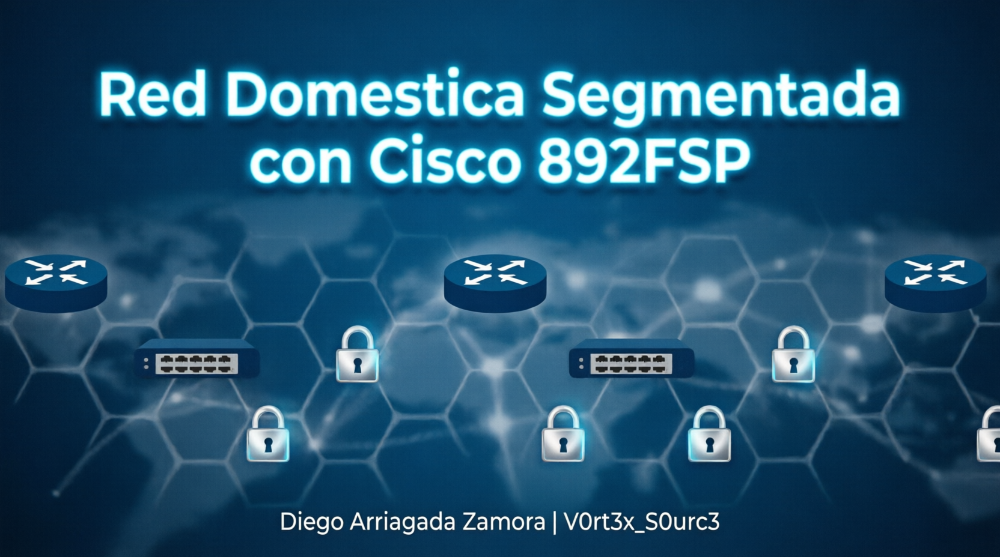
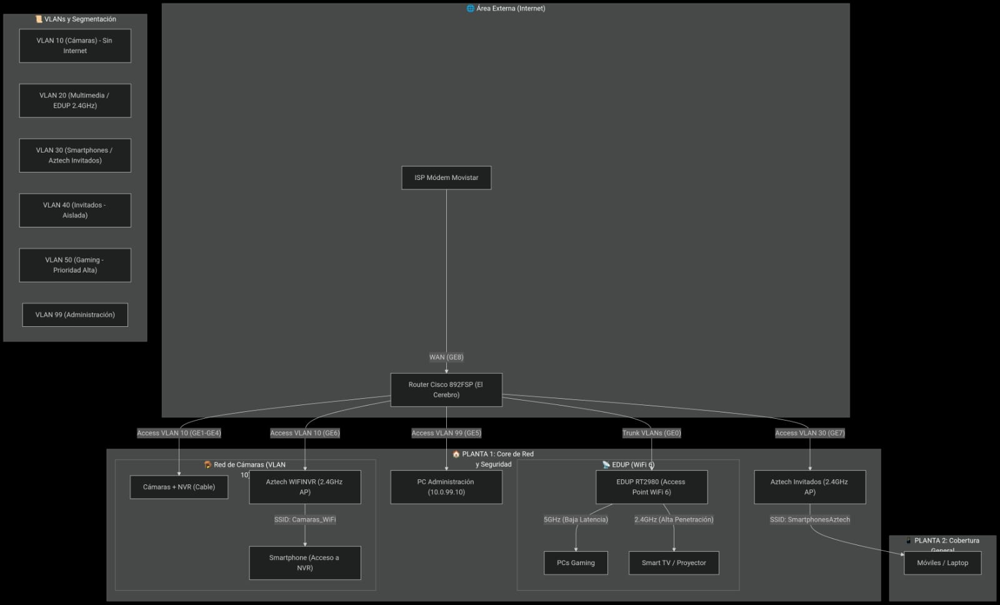
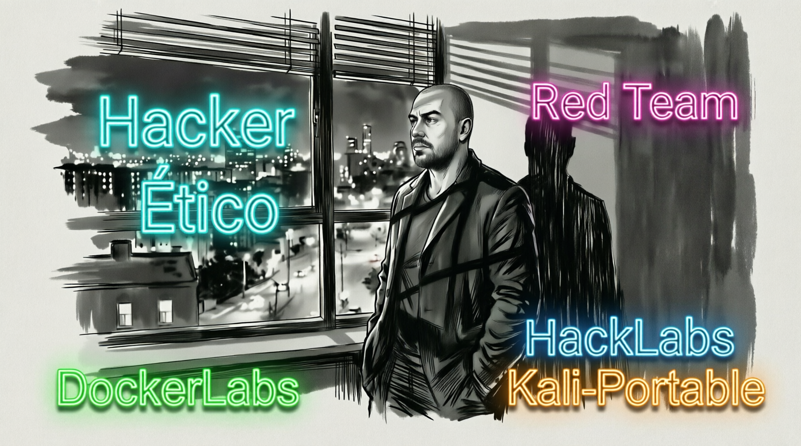

# 🏠 Red Doméstica Segmentada con Cisco 892FSP

**Diego Arriagada Zamora | V0rt3x_S0urc3**

### 🎯 Pentester | Red Team | Hacker Ético

## 📝 Descripción del Proyecto

*Este proyecto documenta el diseño, configuración e implementación de una infraestructura de red doméstica segmentada y segura. El objetivo principal fue aplicar conceptos de* **networking empresarial (VLANs, QoS, ACLs) y ciberseguridad (segmentación, aislamiento, acceso remoto seguro)** *en un entorno real, utilizando hardware profesional (Cisco 892FSP) y equipos de consumo avanzado con* **OpenWrt**.

*La red resultante está preparada para soportar múltiples dispositivos (cámaras de seguridad, PCs de gaming, smartphones, dispositivos IoT e invitados) garantizando un alto rendimiento, baja latencia y un estricto control de acceso entre los diferentes segmentos.*

---

## 🎯 Objetivos del Proyecto

1.  **Segmentación de Red (VLANs):** *Aislar el tráfico de dispositivos por tipo de uso y nivel de confianza (Cámaras, Gaming, Multimedia, Smartphones, Invitados, Administración).*
2.  **Calidad de Servicio (QoS):** *Priorizar el tráfico de* **gaming** *sobre el resto de la red para garantizar una latencia mínima.*
3.  **Seguridad Perimetral:** *Aislar la red de* **cámaras** *del acceso a Internet y del resto de VLANs.*
4.  **Acceso Remoto Seguro:** *Implementar un servidor* **WireGuard** *para acceder a la red de forma cifrada desde el exterior.*
5.  **Centralización y Control:** *Utilizar un* **Router Cisco 892FSP** *como núcleo de la red, gestionando el ruteo, DHCP, NAT y ACLs.*
6.  **WiFi de Alto Rendimiento:** *Integrar puntos de acceso* **WiFi 6** *para ofrecer baja latencia (5GHz) y amplia cobertura (2.4GHz).*

---

## 🛠️ Hardware Utilizado

| *Componente* | *Modelo* | *Función en la Red* |
| :--- | :--- | :--- |
| **Router Principal** | **Cisco 892FSP** | *Núcleo de la red. Gestiona VLANs, DHCP, NAT, QoS, ACLs y ruteo entre segmentos.* |
| **Access Point WiFi 6** | **EDUP RT2980 (OpenWrt)** | *Punto de acceso principal. Ofrece 5GHz para Gaming y 2.4GHz para Multimedia.* |
| **Access Point 2.4GHz** | **Aztech WL559E (x2)** | *Puntos de acceso en modo "Access Point" para redes de Smartphones (VLAN 30) e Invitados (VLAN 40).* |
| **Switch Cámaras** | **(Opcional)** | *Switch dedicado para conectar cámaras IP y NVR en la VLAN 10 (aislada).* |
| **PC de Administración** | - | *Equipo conectado al puerto de administración (VLAN 99) para gestionar el router.* |

---

## 🗺️ Arquitectura de Red

*La red se segmenta en* **6 VLANs** *lógicas, cada una con un propósito específico.*

| *VLAN ID* | *Nombre* | *Red* | *Propósito* | *Acceso a Internet* |
| :--- | :--- | :--- | :--- | :--- |
| **10** | `CAMARAS` | `10.0.10.0/29` | *Cámaras IP y NVR. Red aislada y segura.* | **No** |
| **20** | `MULTIMEDIA` | `10.0.20.0/29` | *Smart TV, Proyector.* | **Sí** |
| **30** | `SMARTPHONES` | `10.0.30.0/29` | *Smartphones personales, laptop de estudios.* | **Sí** |
| **40** | `INVITADOS` | `10.0.40.0/28` | *Red WiFi para invitados. Aislada de redes internas.* | **Sí** *(limitado)* |
| **50** | `GAMING` | `10.0.50.0/29` | *PCs de gaming. Prioridad máxima en QoS.* | **Sí** |
| **99** | `ADMIN` | `10.0.99.0/29` | *Red de administración para gestionar el router.* | **Sí** |

### Topología General

*graph TD*
    *subgraph "🌐 Internet"*
        ISP[ISP Módem] -- "WAN (GE8)" --> Cisco
    

    *subgraph "🏠 Planta 1: Core"*
        Cisco[Router Cisco 892FSP] -- "Trunk (GE0)" --> EDUP
        Cisco -- "Access VLAN 10 (GE1-GE4)" --> Camaras
        Cisco -- "Access VLAN 99 (GE5)" --> PCAdmin
        Cisco -- "Access VLAN 10 (GE6)" --> AztechCam
        Cisco -- "Access VLAN 30 (GE7)" --> AztechInv
    
        EDUP[EDUP RT2980 (WiFi 6)] -- "5GHz (Gaming)" --> PCGamer
        EDUP -- "2.4GHz (Multimedia)" --> TV
    

    *subgraph "📱 Planta 2: Cobertura"*
        AztechCam[Aztech WIFINVR (2.4GHz)] -- "SSID: Camaras_WiFi" --> SmartphoneCam
        AztechInv[Aztech Invitados (2.4GHz)] -- "SSID: SmartphonesAztech" --> Smartphones
    
    
    *⚙️ Configuraciones Clave*
    
1. *Segmentación y Puertos (Cisco)*

*! Puertos de Cámaras (VLAN 10)*
*interface range GigabitEthernet1-4*
 *switchport mode access*
 *switchport access vlan 10*
 *speed 100*
 *duplex full*

*! Puerto Trunk al EDUP (GE0)*
*interface GigabitEthernet0*
 *description TRUNK_TO_EDUP*
 *switchport mode trunk*
 *switchport trunk allowed vlan 20,30,40,50,99*

*! Puerto Administración (GE5)*
*interface GigabitEthernet5*
 *switchport mode access*
 *switchport access vlan 99*

*! Puerto WIFINVR (GE6) - Aztech para Cámaras*
*interface GigabitEthernet6*
 *description WIFINVR*
 *switchport mode access*
 *switchport access vlan 10*
 *speed 100*
 *duplex full*
 
 2. *Calidad de Servicio (QoS)*

*Para garantizar la mejor experiencia en la VLAN de gaming, se implementó una política de QoS que dedica el 40% del ancho de banda de bajada a la VLAN 50, con prioridad máxima.*

*class-map match-all GAMING-CLASS
 *match access-group name GAMING-NET
 *exit
*policy-map QOS-POLICY
 *class GAMING-CLASS
  *priority percent 40
 *class class-default
  *fair-queue
 *exit
*interface GigabitEthernet8
 *service-policy output QOS-POLICY
 *exit
 
 3. *Reglas de Firewall (ACLs)*

*Se aplicaron listas de acceso para:*

    *Bloquear el tráfico de la VLAN de Cámaras hacia Internet.*

    *Aislar completamente a los dispositivos de la VLAN de Invitados, evitando que accedan a cualquier red interna.*
    
    *! Bloquear Internet a cámaras
*ip access-list extended BLOCK-CAMERAS-INET
 *deny ip any any
 *exit
*interface Vlan10
 *ip access-group BLOCK-CAMERAS-INET in
 *exit

*! Aislar invitados de la red local
*ip access-list extended GUEST-ACL
 *deny ip 10.0.40.0 0.0.0.15 10.0.0.0 0.255.255.255
 *permit ip any any
 *exit
*interface Vlan40
 *ip access-group GUEST-ACL in
 *exit
 
 4. *VPN (WireGuard)*

*Se configuró un servidor WireGuard en el router EDUP (OpenWrt) para proporcionar acceso remoto seguro a la red doméstica, permitiendo la administración y el acceso a las cámaras desde cualquier ubicación.*

*(Archivos de configuración y clientes configurados en los dispositivos personales).*

## 🔧 Desafíos y Soluciones

| *Desafío* | *Solución* |
|-----------|----------|
| **Cisco 892FSP sin PoE** | *Se utilizaron fuentes de alimentación externas para las cámaras.* |
| **Limitación de velocidad (100 Mbps) en puertos LAN** | *Se forzó la velocidad y el duplex en los puertos de cámaras para garantizar estabilidad.* |
| **Acceso SSH a Cisco con IOS antiguo** | *Se configuró el cliente SSH con parámetros de compatibilidad* (`-oKexAlgorithms`, `-oHostKeyAlgorithms`) *para establecer la conexión.* |
| **Segmentación de WiFi** | *Se utilizó OpenWrt en los puntos de acceso para crear múltiples SSIDs y asignar cada uno a una VLAN específica.* |

📈 *Resultados y Aprendizajes*

    *Segmentación: Se logró una segmentación completa del tráfico, mejorando la seguridad y el rendimiento.*

    *Rendimiento: La priorización de tráfico ha eliminado la latencia en los juegos online, incluso con otros dispositivos en streaming.*

    *Seguridad: Las cámaras están completamente aisladas de Internet, reduciendo el riesgo de exposición.*

    *Administración: El acceso a la red está centralizado en el Cisco, con un puerto de administración dedicado (VLAN 99).*

    *Aprendizaje: Se consolidaron conocimientos prácticos de redes empresariales, segmentación avanzada y administración de equipos Cisco y OpenWrt.*
    
    *🚀 Futuras Mejoras*

    *Despliegue de un Honeypot: Instalación de un T-Pot en una VLAN aislada para analizar tráfico malicioso y mejorar la inteligencia de amenazas.*

    *Integración de SIEM: Incorporar Wazuh para la centralización y correlación de logs de seguridad.*

    *Automatización de Backups: Programar backups de la configuración a un servidor local o NAS.*

    *Mejora de Cobertura: Actualizar los puntos de acceso 2.4GHz a modelos con WiFi 6 para una mayor velocidad y eficiencia.*
    
    
    
   
   *⚠️ Disclaimer*

*Este repositorio es SOLO para fines educativos y auditorías autorizadas.*
*El uso indebido de estas herramientas es responsabilidad exclusiva del usuario.*
*Respeta siempre las leyes y obtén autorización antes de realizar pruebas de penetración.*
**🇨🇱 Chile - Ley 19.223:** *El acceso no autorizado a sistemas informáticos es un delito.*

   
   *🔥 ¿Te gustó el proyecto?*
*¡Dale una estrella ⭐ en GitHub!*

### 🎯 Pentester | Red Team | Hacker Ético

