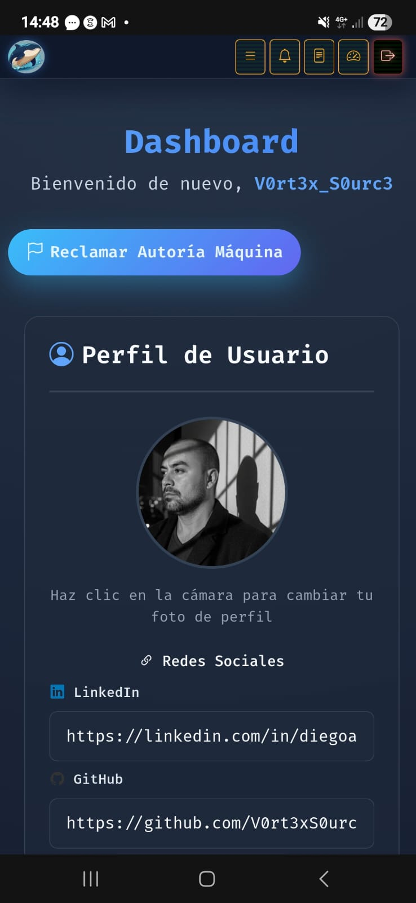
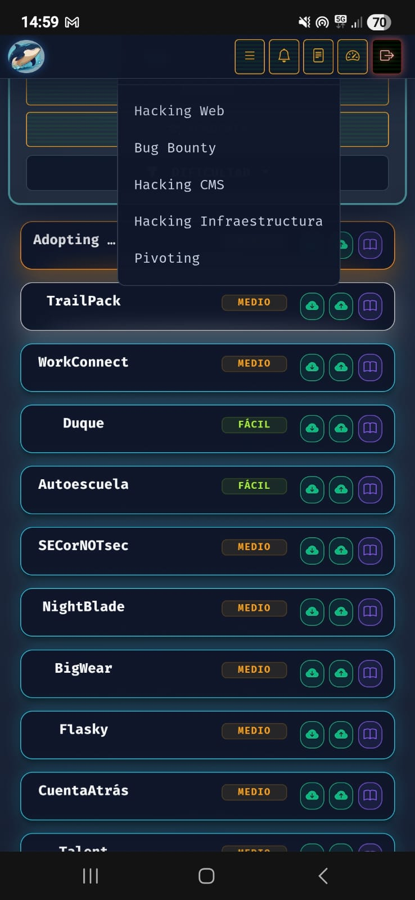

<h1>WriteUps de DockerLabs.es</h1>
  

## ❓ ¿De qué se trata DockerLabs?

DockerLabs aloja 193 Máquinas Vulnerables para poner en práctica nuestros conocimientos y hábilidades en hacking Ético desde niveles **Muy Fácil hasta Dificil** y categorías **Hacking Infraestructura, Hacking Web, Hacking CMS, Bug Bounty y Pivoting** donde se aprende con la práctica, avanzas y generas experiencia, etc.

> [!NOTE]
>
>Puede ingresar y ser parte de los participantes en  **[DockerLabs](https://dockerlabs.es)**

 
