

# FirstHacking From DockerLabs.es

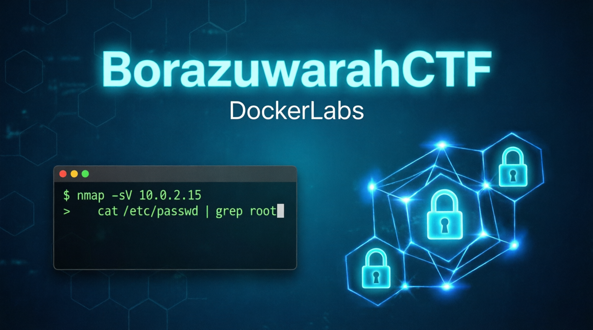

## ❓ ¿De qué se trata BorazuwarahCTF?

*BorazuwarahCTF es una máquina vulnerable en docker en categoria "Súper Fácil" de la web **[DockerLabs](https://dockerlabs.es/)**, en la cual podremos practicar Hacking a Infraestructura; exclusivamente **esteganografía y fuerza bruta contra protocolos de red** para lograr la flag de acceso a root, según la descripción.*

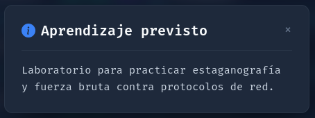

> [!NOTE]
>
>*Puede descargar la máquina a través del* **[enlace mega](https://mega.nz/file/gWNQlaZD#CgYMb_EEBL0jcypTg0xZZUaIqhO47ueX6pPU6utLy1U)**

## 🔝 Despliegue Máquina FirstHacking

*Al descargar la máquina, es necesario descomprimir.*

**unzip borazuwarahCTF.zip.**

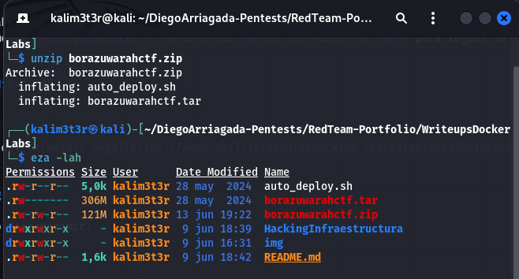

*Obtendremos dos ficheros:*
*- **Auto_deploy.sh:** Script Bash para desplegar nuestra máquina localmente.*
*- **borazuwarahctf.tar:** Máquina vulnerable contenizada.*

*Para desplegar el servicio será necesario permisos de ejecución a auto_deploy.sh, ya que por defecto tiene permisos 644. Para ello, usaremos el comando:*

 **chmod +x auto_deploy.sh**
 
 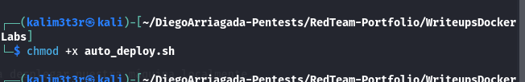

 *Una vez ejecutado, se utilizará el comando **./auto_deploy.sh firsthacking.tar** para lanzar la máquina vulnerable.*

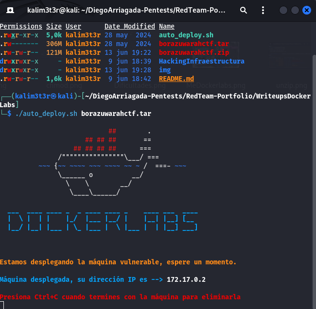

## 🔎 Fase de Preparación
*Abrimos una segunda ventana de terminal donde trabajaremos, ejecutando* **./run-kali.sh normal**... *(Proyecto propio de kali portable en el siguiente repo,* **[Vortex_Source](https://github.com/V0rt3xS0urc3/RedTeam-Portfolio)**

*En una nueva terminal comenzamos haciendo 3 ping a la ip que nos ha dado el contenedor,* **(172.17.0.2)** *y luego de detectar que está vivo, escaneamos con Nmap.*
*En esta ocación, se usará el comando* **nmap -sC -sV --min-rate 2000 172.17.0.2** 

*| Argumento | Significado |*
*|---|---|*
*| -sC | Ejecuta los scripts para comprobaciones comunes |*
*| -sV | Detección de versiones de servicios |*
*| --min-rate 2000 | Envía 2000 paquetes por segundo (aumenta velocidad; puede causar pérdida o detección) |*
*| 172.17.0.2 | Dirección IP del objetivo a escanear |*

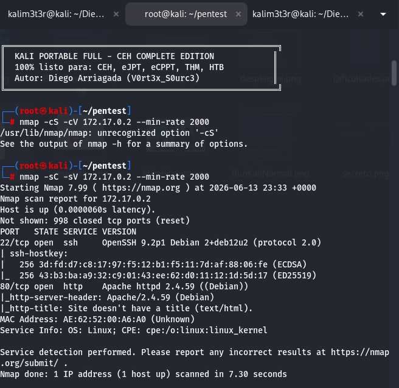

> [!NOTA]
>
>*Como estamos en un entorno controlado se usa modo agresivo. en entornnos reales será necesario utilizar el argumento **-sS** para no ser detectado por algun IDR,* **no se usará --min-rate.**

*Hemos encontrado 2 puertos abiertos:*
**SSH (Puerto: 21):** *Puerto SSH OpenSSH 9.2p1.*
**HTTP (Puerto: 80):** *Puerto HTTP.*

*Ahora entraremos en la URL* **http://172.17.0.2** *para ver que encontramos y revisamos el inspector en busca de algun indicio que nos pueda ayudar, solo vemos una imagen de un* **Buebito Kinder Sorpresa**, *como sabemos que tiene que ver con esteganografía, sigamos al sigueinte paso después de descargar la imagen con* **wget**, *sabemos que se llama* **imagen.jpeg** *gracias al* **inspector**.

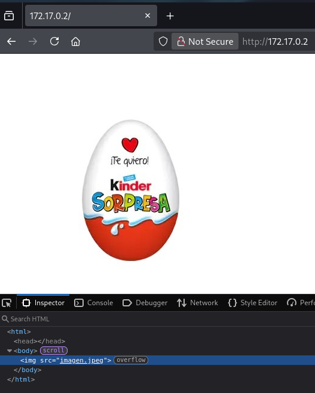

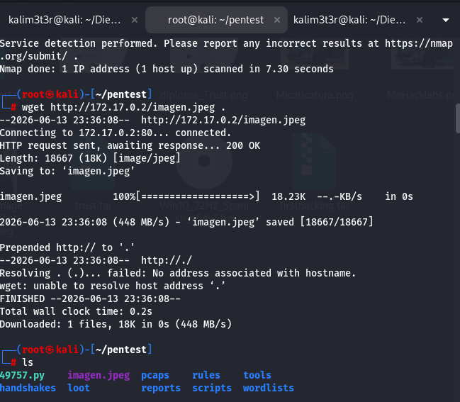

*Antes de revisar la imagen haremos un* **gobuster** *por si acaso buscando los siguientes;* **.jpeg,.jpeg,.png,.php,.txt,.html,.doc** *y vemos la imagen del huevito y nada mas que nos sirva.*

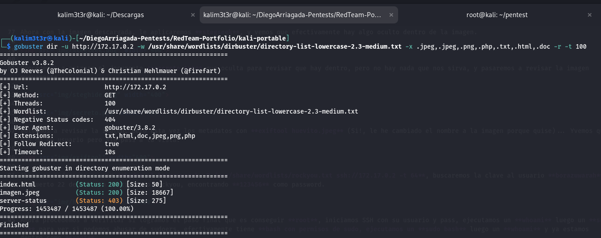

*Ahora con la imagen descargada, le aplicaremos* **stegseek**, *y vemos que efectivamente hay algo oculto dentro de la imagen.*

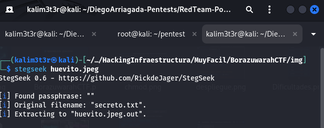

*Procedemos a extraer el documento* **secreto.txt** *que oculta para revisar que hay dentro, pero no hay nada que nos sirva, y pasaremos a revisar la imagen nuevamente.*

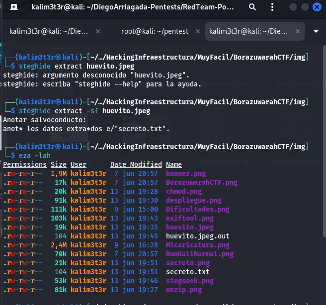

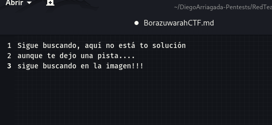

*Volvemos a revisar la imagen, pero esta vez los metadatos con* **exiftool huevito.jpeg** *(Si!, le he cambiado el nombre a la imagen porque quise)... Yvemos que nos da un usuario pero sin pass a la vista.*

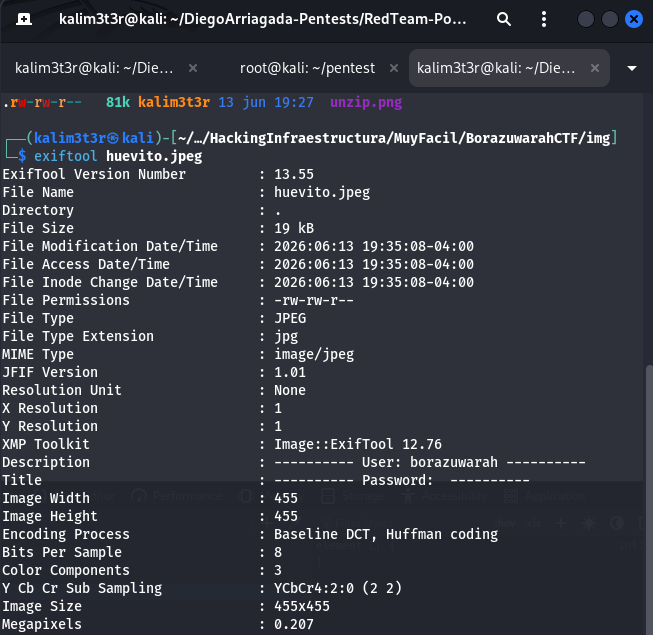

*Ahora procederemos a usar* **hydra -l borazuwarah -P /usr/share/wordlists/rockyou.txt ssh://172.17.0.2 -t 64**, *buscaremos la clave al usuario* **borazuwarah** *al puerto 22 de ssh con diccionario rockyou, encontrando* **123456** *como password.*

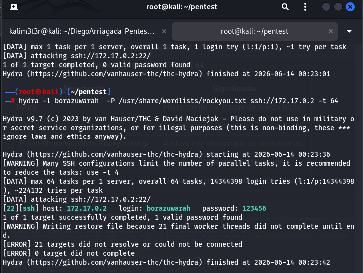

*También quise probar la velocidad de un* **script de nmap**, *primero creando un txt con el usuario borazuwarah,* **echo -e "borazuwarah">usuarios.txt**, *para luego correr el script* **nmap -p 22 --script ssh-brute --script-args userdb=usuarios.txt,passdb=top1000.txt 172.17.0.2** *con el mismo diccionario top1.000 que usamos con* **Hydra**, *y solo demoró 3.21 segundos y hydra demoró 6 segundos. En fin... Que divertido aprender con DockerLabs.*

*Ahora procedemos a verificar si logramos el paso final que es conseguir* **root**, *iniciamos SSH con su usuario y pass, ejecutamos un* **whoami** *luego un **sudo -l** para ver si podemos abusar de sudoers, efectivamente tiene* **bash con permisos de sudo, ejecutamos un **sudo bash** *luego un* **whoami** *y ya estamos dentro como* **root**.

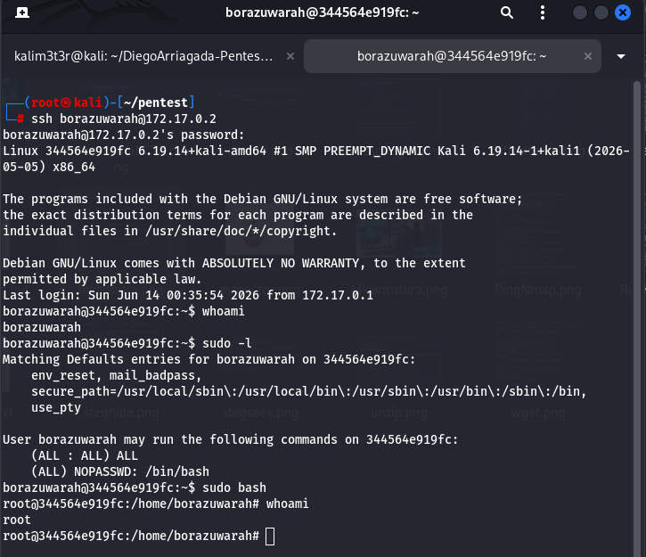

## 🧪 Post-Laboratorio
*Una vez finalizada la máquina, presionamos lacombinación de teclas* **Control + C** *para eliminarla!!!.*

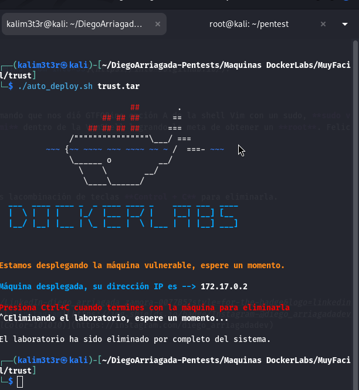

**Exit** *a nuestra máquina kali portable.*

## 🔥 ¿Te gustó el WriteUp? Dale una estrella ⭐ en GitHub!

🔥 *¿Te gustó el WriteUp?*
*¡Dale una estrella ⭐ en* **!**

### 🎯 Pentester | Red Team | Hacker Ético

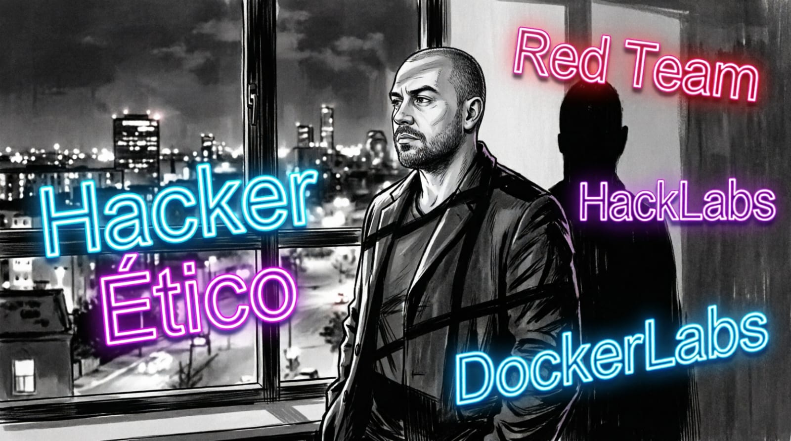

*

 
