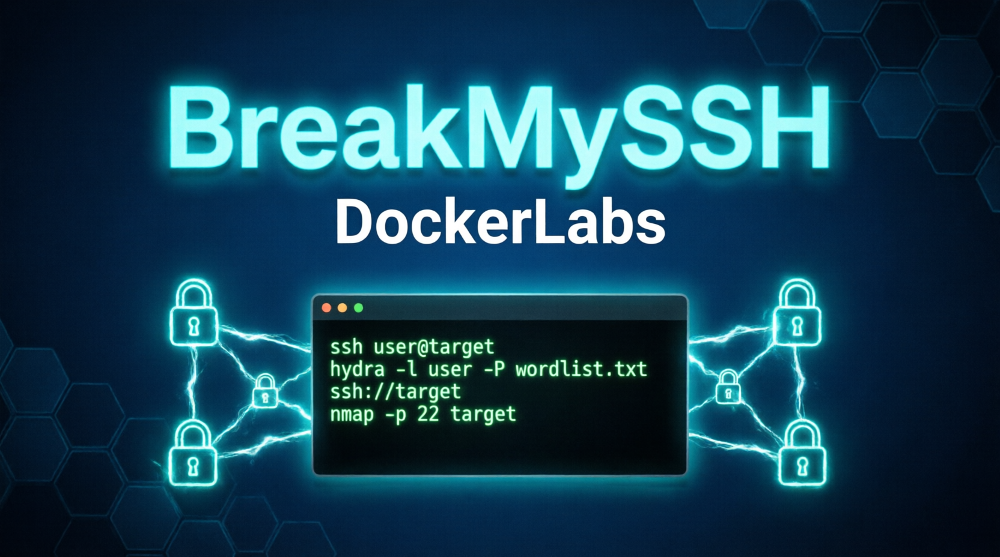
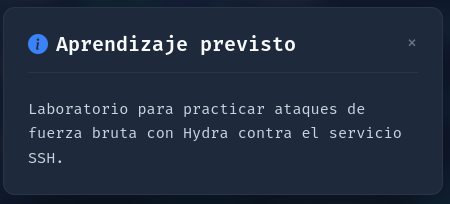
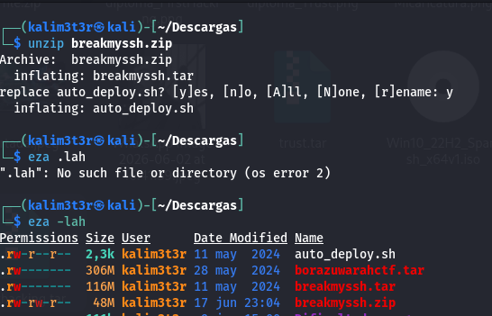
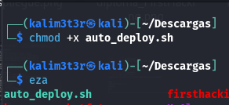
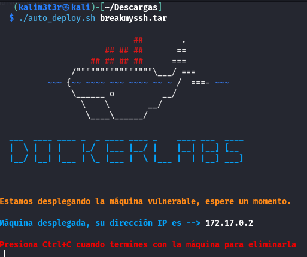
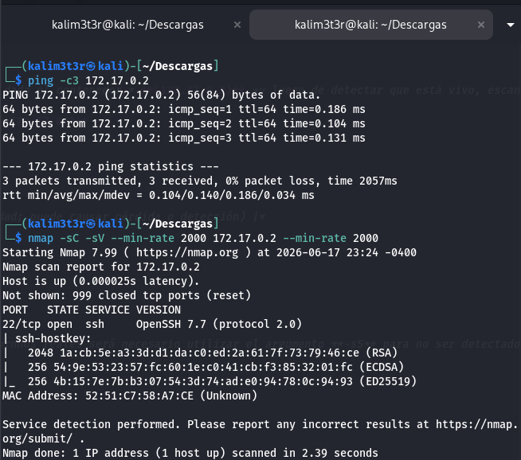
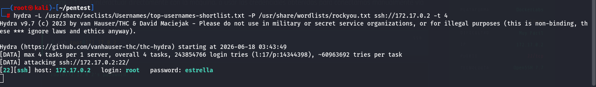
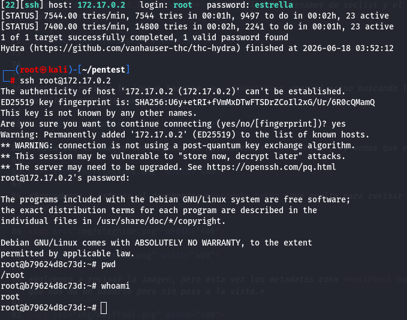
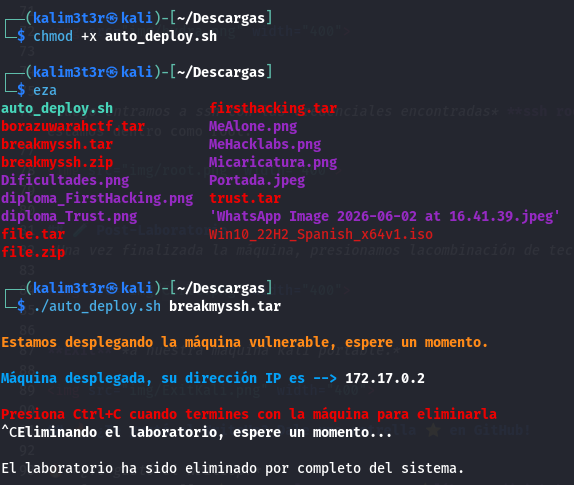

# BreakMySSH From DockerLabs.es

## ❓ ¿De qué se trata BreakMySSH?

*BreakMySSH es una máquina vulnerable en docker en categoria "Súper Fácil" de la web **[DockerLabs](https://dockerlabs.es/)**, en la cual podremos practicar Hacking a Infraestructura; exclusivamente **fuerza bruta con hydra contra protocolo SSH** para lograr la flag de acceso a root, según la descripción.*

> [!NOTE]
>
>*Puede descargar la máquina a través del* **[enlace mega](https://mega.nz/file/hfE3lbwZ#ExAcF54AyOHeJqgH2R4cDIAGc5IVlJnI5Rs-Us2QMpM)**

## 🔝 Despliegue Máquina BreakMySSH

*Al descargar la máquina, es necesario descomprimir.*

**unzip breakmyssh.zip.**

*Obtendremos dos ficheros:*
*- **Auto_deploy.sh:** Script Bash para desplegar nuestra máquina localmente.*
*- **breakmyssh.tar:** Máquina vulnerable contenizada.*

*Para desplegar el servicio será necesario permisos de ejecución a auto_deploy.sh, ya que por defecto tiene permisos 644. Para ello, usaremos el comando:*

 **chmod +x auto_deploy.sh**
 
 

 *Una vez ejecutado, se utilizará el comando **./auto_deploy.sh breakmyssh.tar** para lanzar la máquina vulnerable.*

## 🔎 Fase de Preparación
*Abrimos una segunda ventana de terminal donde trabajaremos, ejecutando* **./run-kali.sh normal**... *(Proyecto propio de kali portable en el siguiente repo,* **[Vortex_Source](https://github.com/V0rt3xS0urc3/RedTeam-Portfolio)**

*En una nueva terminal comenzamos haciendo 3 ping a la ip que nos ha dado el contenedor,* **(172.17.0.2)** *y luego de detectar que está vivo, escaneamos con Nmap.*
*En esta ocación, se usará el comando* **nmap -sC -sV --min-rate 2000 172.17.0.2** 

*| Argumento | Significado |*
*|---|---|*
*| -sC | Ejecuta los scripts para comprobaciones comunes |*
*| -sV | Detección de versiones de servicios |*
*| --min-rate 2000 | Envía 2000 paquetes por segundo (aumenta velocidad; puede causar pérdida o detección) |*
*| 172.17.0.2 | Dirección IP del objetivo a escanear |*

> [!NOTA]
>
>*Como estamos en un entorno controlado se usa modo agresivo. en entornnos reales será necesario utilizar el argumento **-sS** para no ser detectado por algun IDR,* **no se usará --min-rate.**

*Hemos encontrado 1 puerto abierto:*
**SSH (Puerto: 21):** *Puerto SSH OpenSSH 9.2p1.*

*Usaremos Hydra para encontrar el usuario y password de SSH* **hydra -L /usr/share/seclists/Usernames/top-usernames-shortlist.txt -P /usr/share/wordlists/rockyou.txt ssh://172.17.0.2 -t 4** *usando el top usernames de seclist y el diccionario rockyou, logramos encontrar el usuario: * **root** *con la password:* **estrella**.

*Luego entramos a ssh con las credenciales encontradas* **ssh root@172.17.0.2** *y contraseña* **estrella**, hacemos pwd y luego whoami, y verifdicamos qyue ya estamos dentro como root.

## 🧪 Post-Laboratorio
*Una vez finalizada la máquina, presionamos lacombinación de teclas* **Control + C** *para eliminarla!!!.*

**Exit** *a nuestra máquina kali portable.*

## 🔥 ¿Te gustó el WriteUp? Dale una estrella ⭐ en GitHub!

🔥 *¿Te gustó el WriteUp?*
*¡Dale una estrella ⭐ en* **!**

### 🎯 Pentester | Red Team | Hacker Ético

*

 
