

# FirstHacking From DockerLabs.es

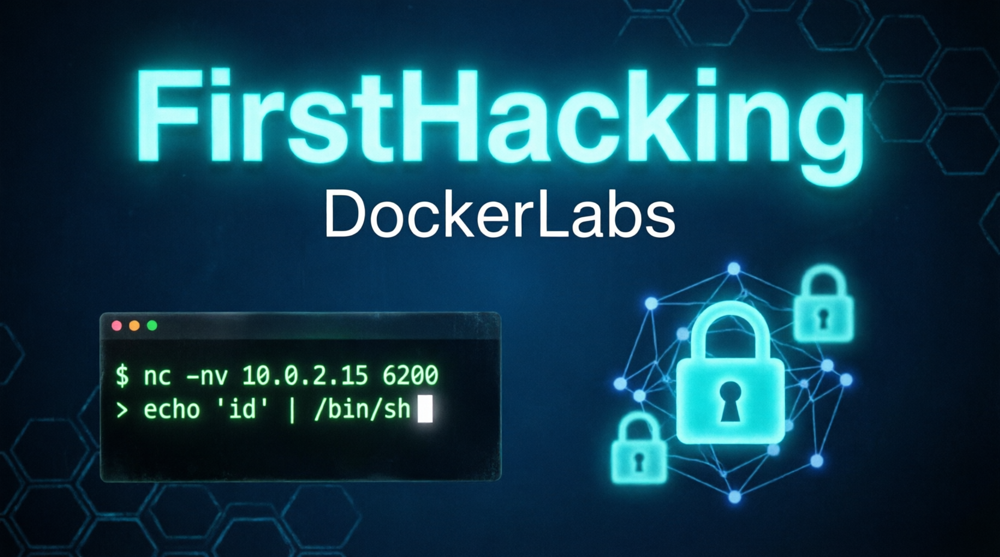

## ❓ ¿De qué se trata Firsthacking?

Firsthacking es una máquina vulnerable en docker en categoria "Súper Fácil" de la web **[DockerLabs](https://dockerlabs.es/)**, en la cual podremos practicar Hacking a Infraestructura; exclusivamente explotación del **backdoor de vsftpd 2.3.4** para lograr la flag de acceso a root, según la descripción.

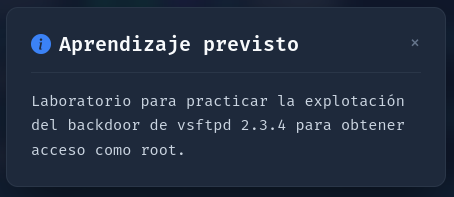

> [!NOTE]
>
>Puede descargar la máquina a través del **[enlace mega](https://mega.nz/file/oCd2VC5D#QfiRoFmZrZ-FjTuyRX9bLw7638fjluwp6jNth7JjXTw)**

## 🔝 Despliegue Máquina FirstHacking

Al descargar la máquina, es necesario descomprimir.

**unzip firsthacking.zip.**

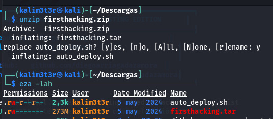

Obtendremos dos ficheros:
- **Auto_deploy.sh:** Script Bash para desplegar nuestra máquina localmente.
- **firsthacking.tar:** Máquina vulnerable contenizada.

Para desplegar el servicio será necesario permisos de ejecución a auto_deploy.sh, ya que por defecto tiene permisos 644. Para ello, usaremos el comando:

 **chmod +x auto_deploy.sh**
 
 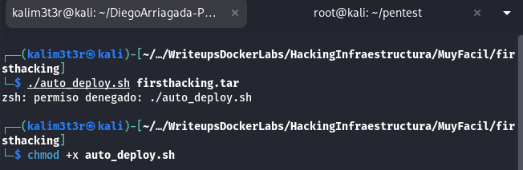

 Una vez ejecutado, se utilizará el comando **./auto_deploy.sh firsthacking.tar** para lanzar la máquina vulnerable.

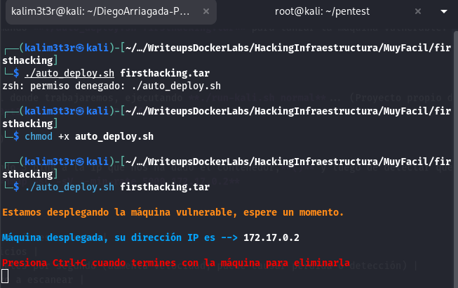

## 🔎 Fase de Preparación
Abrimos una segunda ventana de terminal donde trabajaremos, ejecutando **./run-kali.sh normal**... (Proyecto propio de kali portable en el siguiente repo, **[Vortex_Source](https://github.com/V0rt3xS0urc3/RedTeam-Portfolio)**

En una nueva terminal comenzamos haciendo 3 ping a la ip que nos ha dado el contenedor,**(172.17.0.2)** y luego de detectar que está vivo, escaneamos con Nmap. 
En esta ocación, se usará el comando **nmap -sC -sV --min-rate 5000 172.17.0.2**

| Argumento | Significado |
|---|---|
| -sC | Ejecuta los scripts para comprobaciones comunes |
| -sV | Detección de versiones de servicios |
| --min-rate 5000 | Envía al  5000 paquetes por segundo (aumenta velocidad; puede causar pérdida o detección) |
| 172.17.0.2 | Dirección IP del objetivo a escanear |

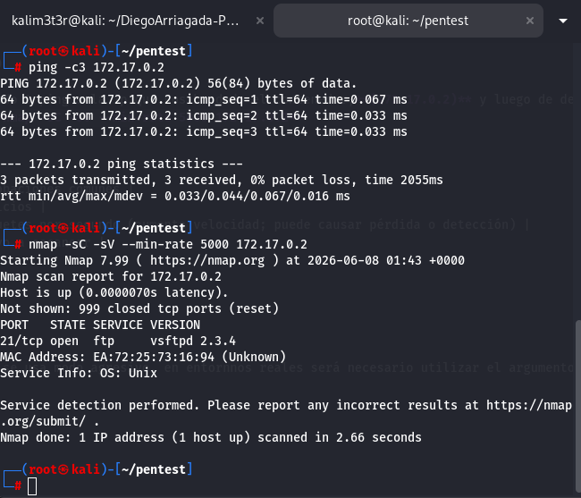

> [!NOTE]
>
>Como estamos en un entorno controlado se usa modo agresivo. en entornnos reales será necesario utilizar el argumento **-sS** para no ser detectado por algun IDR, **no se usará --min-rate.**

Hemos encontrado 1 puerto abierto:
**FTP (Puerto: 21):** Puerto FTP vsftpd 2.3.4, la cual según la consigna es un backdoor.

Entraremos a **Metasploit** a ver si encontramos el **Exploit de vsftpd 2.3.4** con **search vsftpd 2.3.4**... Y efectivamente está dentro para configurar y lanzar, procedemos a usar el exploit con **use exploit/unix/ftp/vsftpd_234_backdoor**, también más facil y rapido podriamos haver puesto **use 0**.

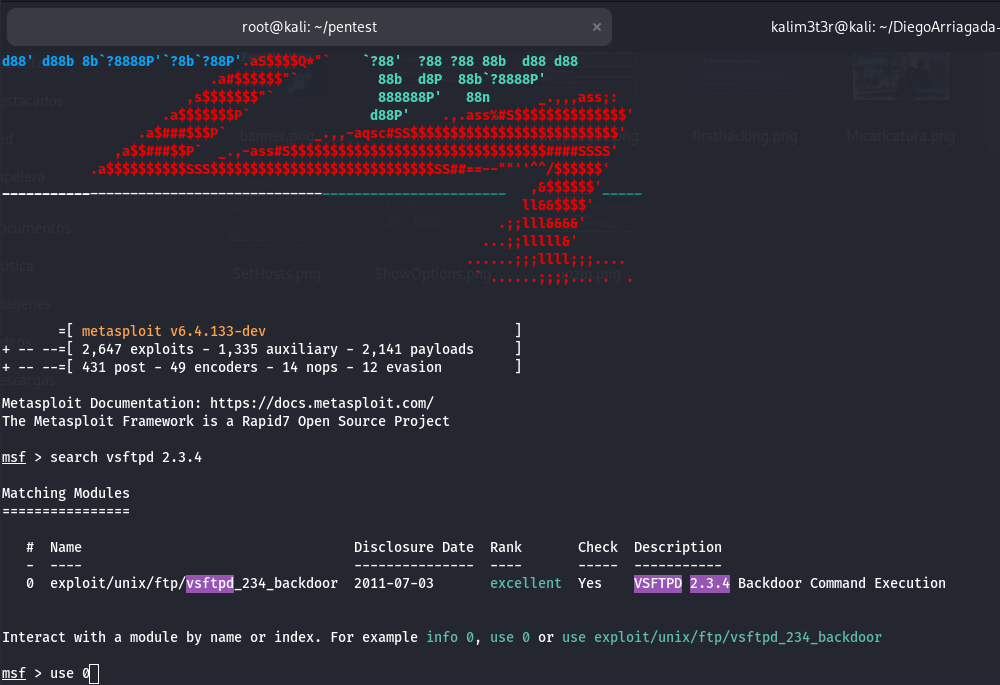

Ahora procedemos a visualizar las opciones con **show options** para configurar **RHOST Y LHOST** con la opción **set**.

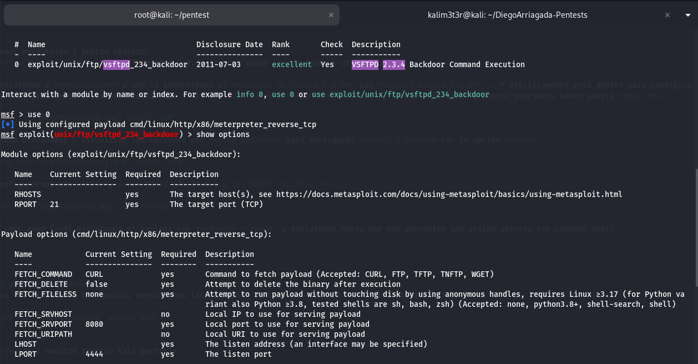

Configuracmos con **SET**, **set RHOST 172.17.0.2 y set LHOST 172.17.0.1**.

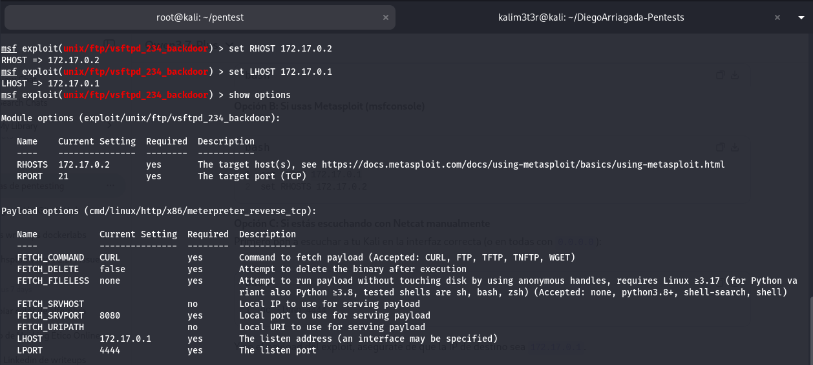

y como paso final ejecutamos el exploit con **exploit o run**, y explotamos hasta que nos encuentre una sesión abierta con comando shell.

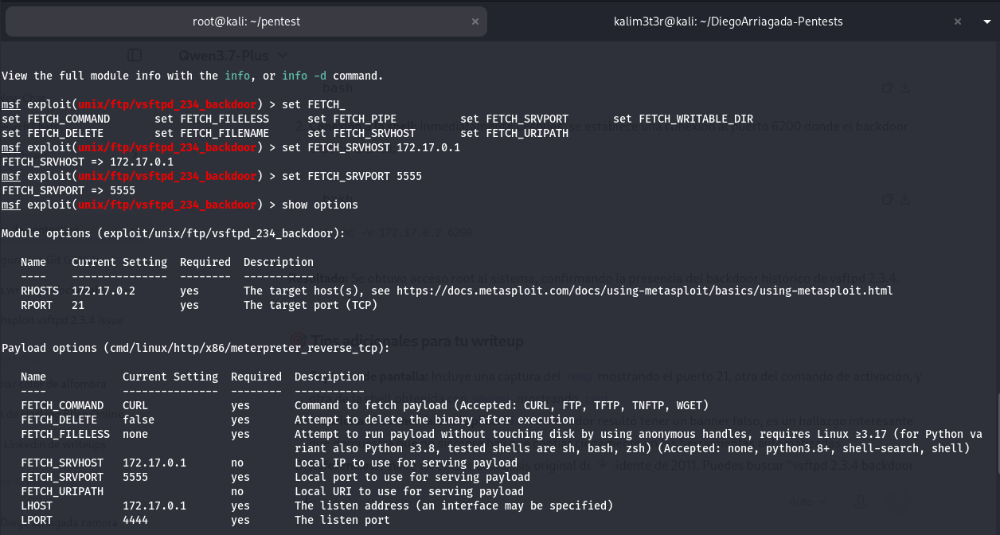

Por una extrañ razón no se ha abierto una shell.

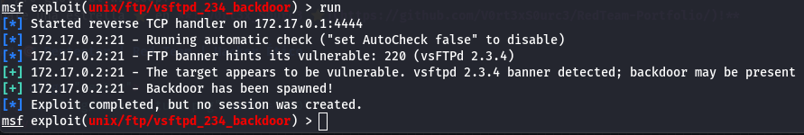

Buscando en la web me encuentro que puedo abrir una sesión con **netcat** con un subshell **(...)** y **echo** con USER **root:)** y que la clave de este exploit es la carita feliz al final de root, la cual nos devuelve una **bindshell** en el puerto 6200 en segundo plano, que se pause 1 segundo con **sleep 1** asi podemos detectar los carateres **:)** y abrir el puerto 6200, y poder poner el PASS **test**, comando completo seria **(echo "USER root:)"; sleep 1; echo "PASS test") | nc 172.17.0.2 21**, y posteriormente ejecutamos un netcat en modo verbose a **FirstHacking** y al puerto 6200 con el siguiente comando **nc -v 172.17.0.2 6200** y bingo!! obtenemos una sesión.

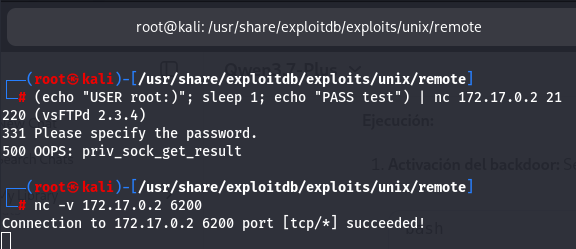

Ahora procedemos a verificar si logramos el paso final que es conseguir **root** con el comando **whoami**.

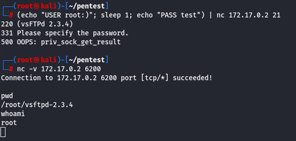

Bingo!! hemos obtenido la flag **root** ... Ahora podriamos haberlo hechos menos complicado, pero como me gusta investigar opciones... Hice primero la dificil, algo que no sabia con **nc**, ahora procederemos a la version facil cuando **msf** falló, que es copiar el exploit que nos devolvió el **searchexploit vsftpd 2.3.4** y entre las 2 opciones una de ellas era un archivo **.py**, especificamente **49757.py** lo he copiado con **cp /usr/share/exploitdb/exploits/unix/remote/49757.py .** el punto al final es para que guarde en mi pwd actual, luego procederemos a ejecutar **python3 49757.py 172.17.0.2** y nos devuelve una shell, ingresamos **whoami** como nos pide la shell obtenida, y Bingo!! nuevamente hemos obtenido la flag **root** por segunda vez.

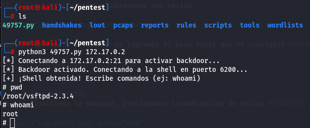

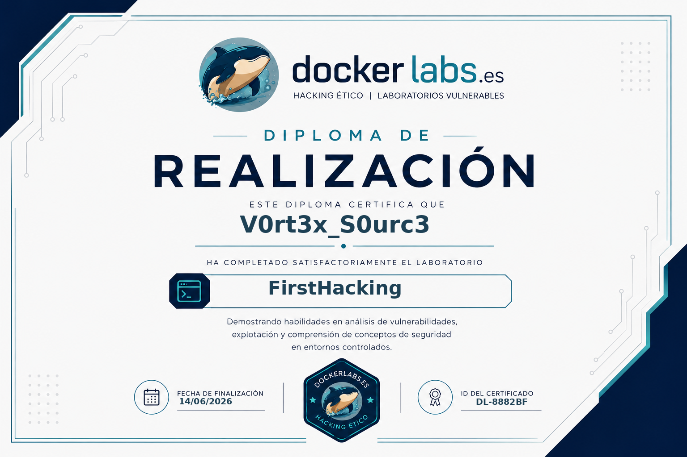

## 🧪 Post-Laboratorio
Una vez finalizada la máquina, presionamos lacombinación de teclas **Control + C** para eliminarla!!!.

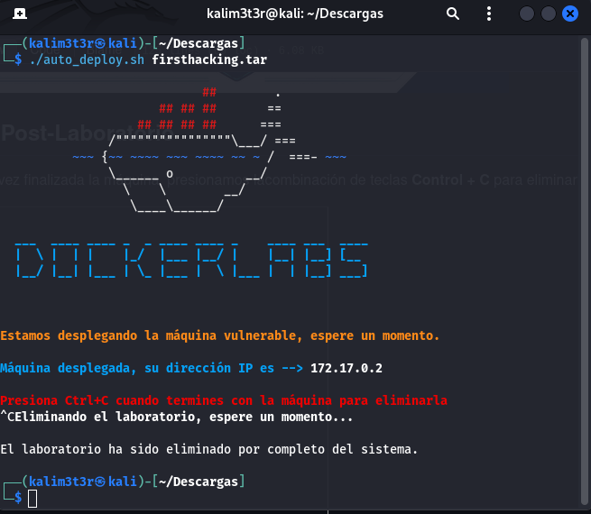

**Exit** a nuestra máquina kali portable.

## 🔥 ¿Te gustó el WriteUp? Dale una estrella ⭐ en GitHub!

🔥 ¿Te gustó el WriteUp?
¡Dale una estrella ⭐ en **!**

### 🎯 Pentester | Red Team | Hacker Ético

 
