<div align="center">

# Trust From DockerLabs.es

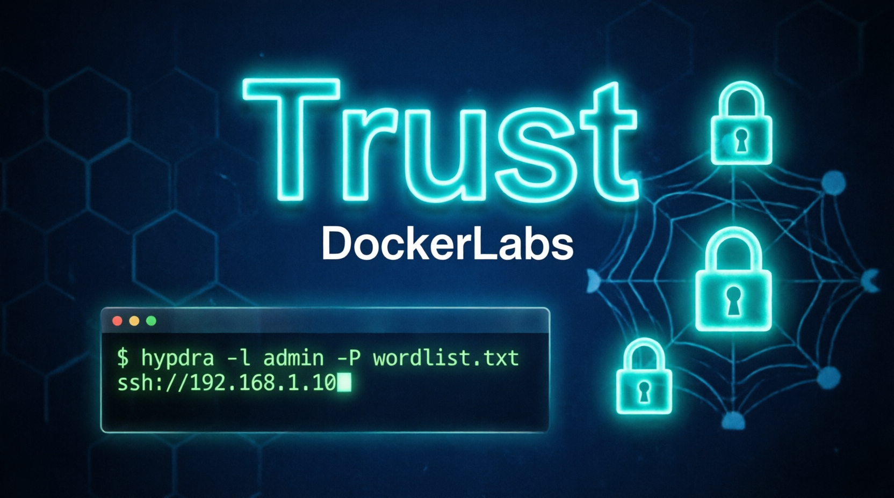

</div>

## ❓ ¿De qué se trata Trust?

Trust es una máquina vulnerable en docker en categoria "Súper Fácil" de la web **[DockerLabs](https://dockerlabs.es/)**, en la cual podremos practicar Hacking a Infraestructura; enumeración web, uso de hydra para fuerza bruta y escalada de privilegios con abuso de sudoers segun la descripción.


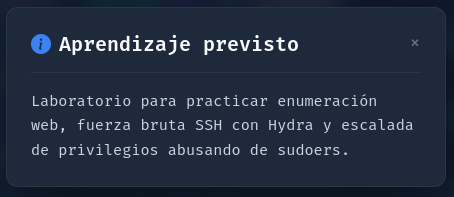


> [!NOTE]
>
> Puede descargar la máquina a través del **[enlace mega](https://mega.nz/file/CUtQjK5S#Le7ZLVQKzsVKG05rvulpLdyG4sR-4Iihs9BLHrwFHIU)**

---

## 🔝 Despliegue Máquina Trust

Al descargar la máquina, es necesario descomprimir.

**unzip trust.zip.**


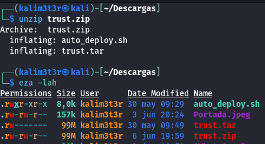


Obtendremos dos ficheros:
- **Auto_deploy.sh:** Script Bash para desplegar nuestra máquina localmente.
- **trust.tar:** Máquina vulnerable contenizada.

Para desplegar el servicio será necesario permisos de ejecución a auto_deploy.sh, ya que por defecto tiene permisos 644. Para ello, usaremos el comando:

```bash
chmod +x auto_deploy.sh

```
 
 
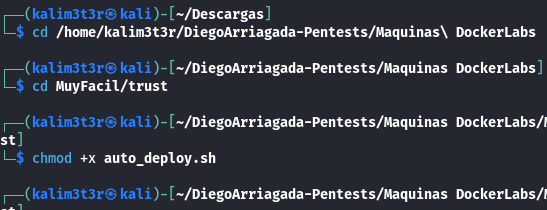


 Una vez ejecutado, se utilizará el comando **./auto_deploy.sh trust.tar** para lanzar la máquina vulnerable.

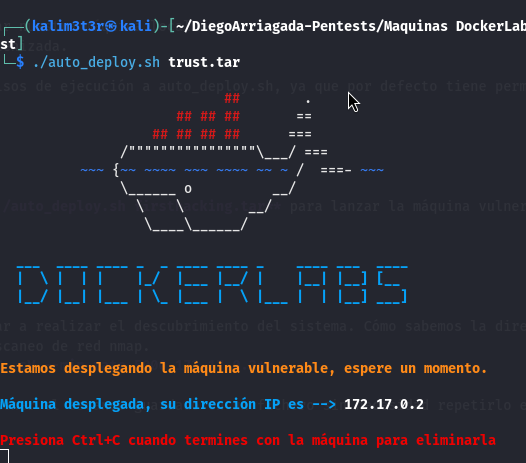

## 🔎 Fase de Preparación
Abrimos una segunda ventana de terminal donde trabajaremos, ejecutando **./run-kali.sh normal**... (Proyecto propio de kali portable en el siguiente repo, **[Vortex_Source](https://github.com/V0rt3xS0urc3/RedTeam-Portfolio)**

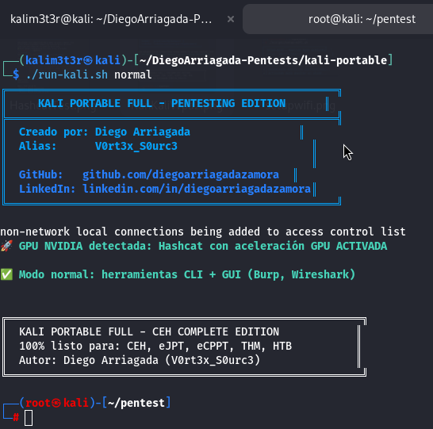

En una nueva terminal comenzamos haciendo 3 ping a lam ip que nos ha dado el contenedor,**(172.17.0.2)** y luego de detectar que está vivo, escaneamos con Nmap. 
En esta ocación, se usará el comando **nmap -sC -sV --min-rate 5000 172.17.0.2**

| Argumento | Significado |
|---|---|
| -sC | Ejecuta los scripts para comprobaciones comunes |
| -sV | Detección de versiones de servicios |
| --min-rate 5000 | Envía al  5000 paquetes por segundo (aumenta velocidad; puede causar pérdida o detección) |
| 172.17.0.2 | Dirección IP del objetivo a escanear |


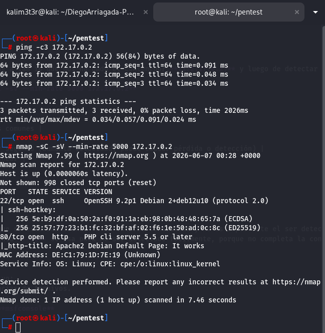

> [!NOTE]
>
>Como estamos en un entorno controlado se usa modo agresivo. en entornnos reales será necesario utilizar el argumento **-sS** para no ser detectado por algun IDR, **no se usará --min-rate.**


Hemos encontrado 2 puertos abiertos:
- **SSH (Puerto: 22):** Protocolo de Conexión cifrada.
- **HTTP (Puerto: 80):** Protocolo de Transferencia de Hipertexto.

Se procede a revisar la ip en puerto 80 del navegador web **http://172.17.0.2/80** y se encuentra Apache2 Debian, y nada relevante procedemos al siguiente pago de enumeración web.


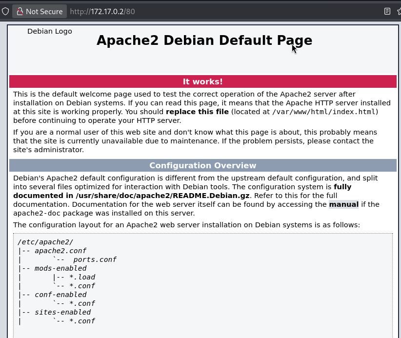

Procedemos a enumerar la IP con gobuster, **gobuster dir -u http://172.17.0.2 -w /usr/share/seclists/Discovery/Web-Content/common.txt -x .php,.txt,.html -r**, pero nos regresa un error de codigo Length:10701.

| Argumento | Significado |
|---|---|
| gobuster | Herramienta de enumeración de directorios y archivos web. |
| dir | Modo de búsqueda de directorios en servidores web. |
| -u http://172.17.0.2 | URL objetivo. |
| -w /usr/share/seclists/Discovery/Web-Content/common.txt | Wordlist utilizada para probar rutas y directorios. |
| -x .php,.txt,.html | Extensiones de archivo que también se intentarán descubrir. |
| -r | Sigue redirecciones automáticamente durante la enumeración. |

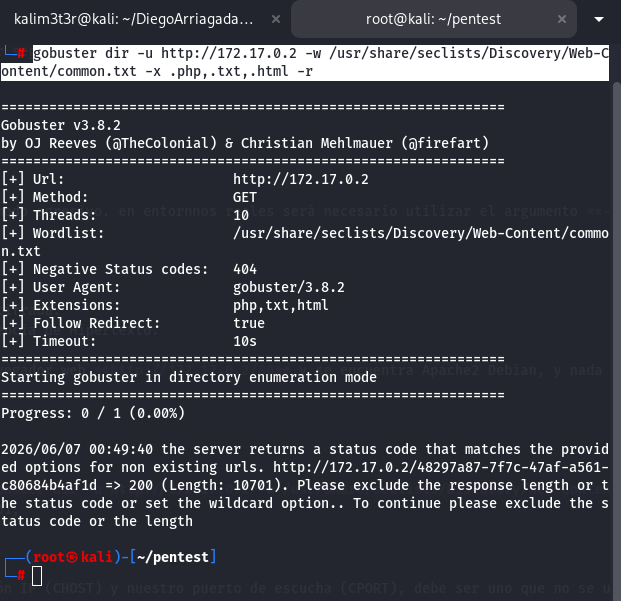

buscando en internet nos recomiendan excluir la respuesta a 10701 junto con threads 100,**gobuster dir -u http://172.17.0.2 -w /usr/share/seclists/Discovery/Web-Content/common.txt -x .php,.txt,.html -r --exclude-length 10701 -t 100** y !Bingo, encontramos en solo 10s que existe **secret.php**.


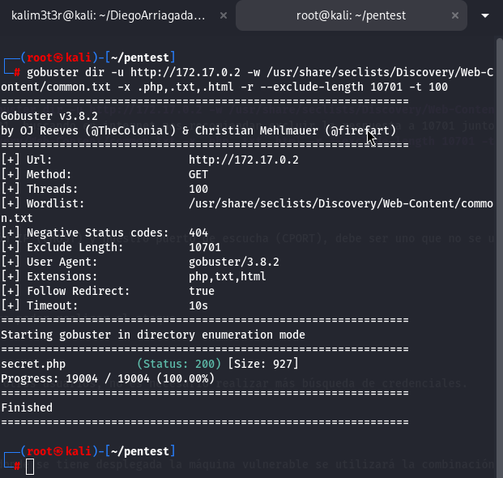

Ahora procederemos a revisar **http://172.17.0.2/secret.php**, donde revisamos si encontramos algo en inspeccionar, y nada relevante más que un nombre en pantalla **Hola Mario** y que la web no se puede hackear, pero tenemos algo, un posible nombre para entrar al sistema.


procedemos a probar el puerto ssh que decubrimos ingresando con el nombre que hemos descubierto de la pagina secret.php **Mario**, y Bingo! nos ha aceptado en nombre de usuario para ingresar ya que nos pide password, procederemos a romper la clave con **Hydra**, pero antes de hacerlo, como sabemos que esta es una maquina modo **Súper Fácil** vamos a suponer que la clave no está muy lejos, por lo tanto tomaremos el diccionario RockYou.txt y le sacaremos solo los primeros 1000 contraseñas más comunes con **head -n 1000 /usr/share/wordlists/rockyou.txt > top1000.txt**.

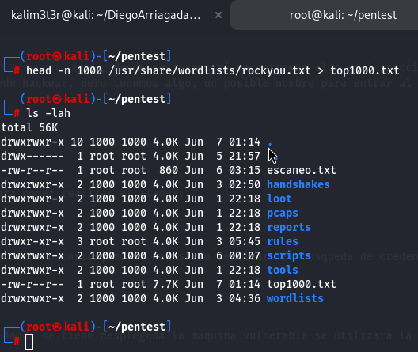

Ahora procedemos con Hydra, **hydra -l mario -P top1000.txt ssh://172.17.0.2 -t 4** Bingo! en sólo 24s se ha encontrado la password **chocolate**.

Acceso al servidor SSH con **ssh mario@172.17.0.2** y ponemos pa password **chocolate** Bingo nuevamente! estamos dentro del sistema como mario.

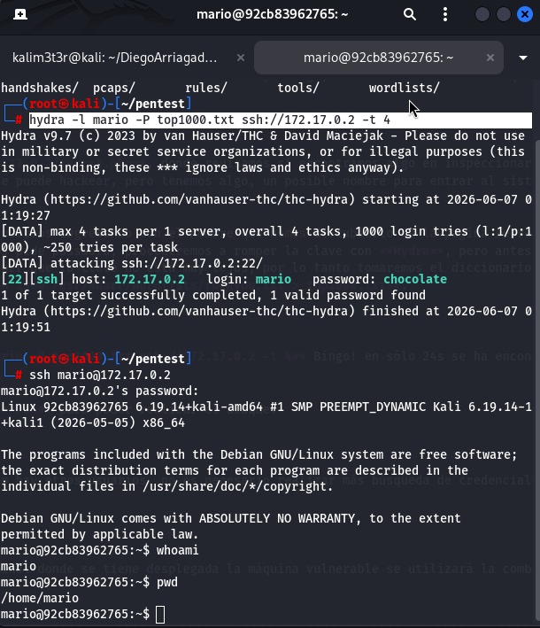

Ahora procederemos a ver si tiene configuraciones sudo mal hechas con **sudo -l** y podemos ver que tiene **(ALL) /usr/bin/vim** sin root .

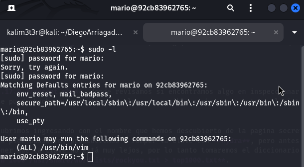

Procedemos a buscar un shell vim en .

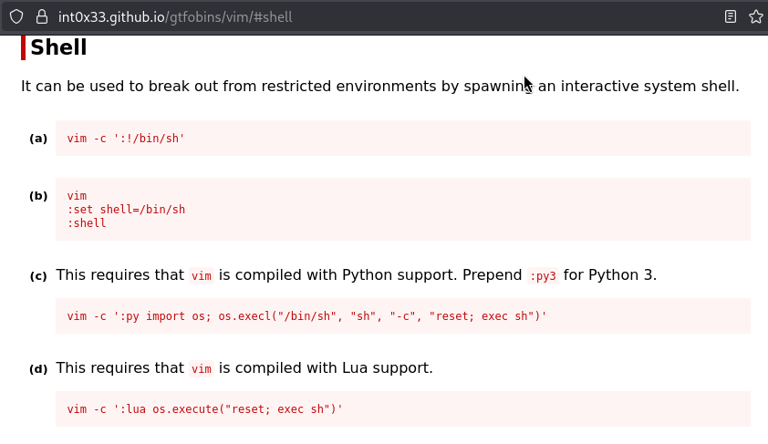

Volvemos a la consola para ejecutar el comando que nos dió GTFOBins opción A de la shell Vim con un sudo, **sudo vim -c ':!/bin/sh'**, y obtuvimos el último Bingo! de esta maquina al hacer un **whoami** dentro de la VimShell logrando la meta de obtener un **root**. Felicidades para mi!!!

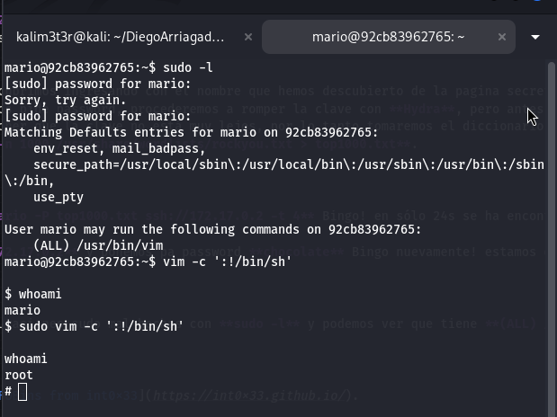

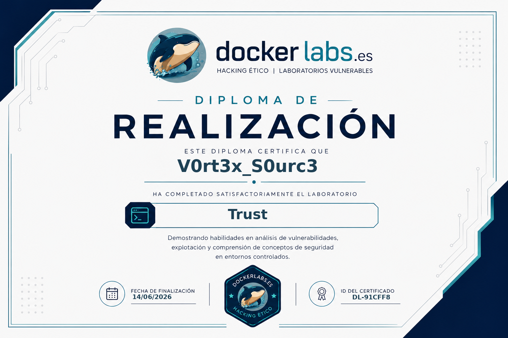


## 🧪 Post-Laboratorio
Una vez finalizada la máquina, presionamos lacombinación de teclas **Control + C** para eliminarla!!!.


**Exit** a nuestra máquina kali portable.

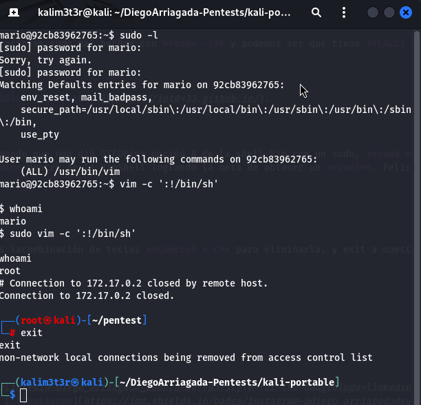

## 🔥 ¿Te gustó el WriteUp? Dale una estrella ⭐ en GitHub!

🔥 ¿Te gustó el WriteUp?
¡Dale una estrella ⭐ en **!**

### 🎯 Pentester | Red Team | Hacker Ético

<div align="center">
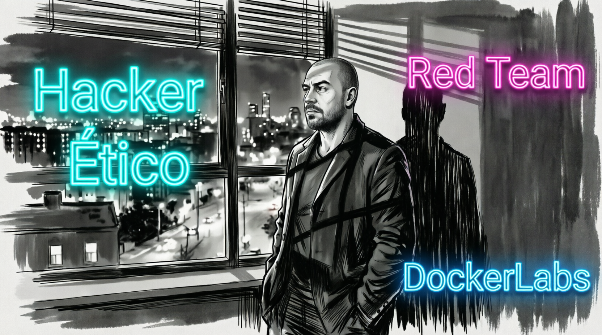
</div>


[](https://www.linkedin.com/in/diegoarriagadazamora) [](https://instagram.com/diego_arriagadadev)
